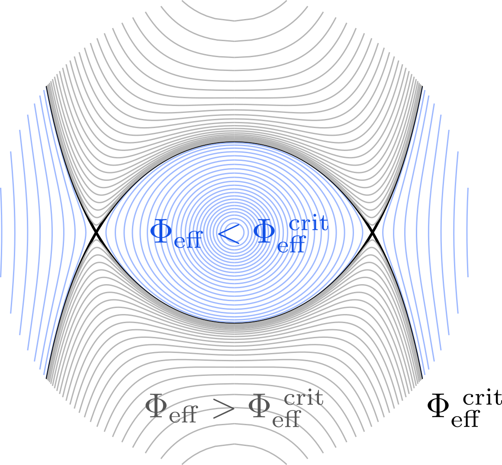
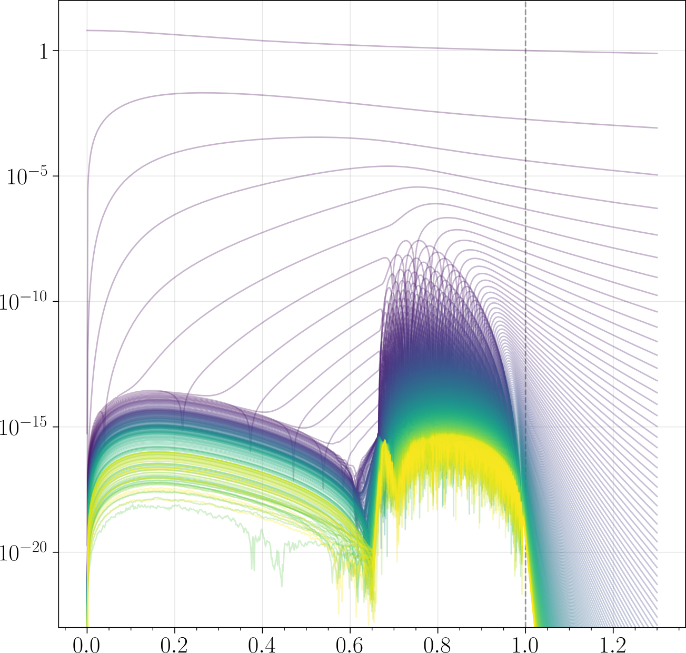

<a name="readme-top"></a>


<!-- PROJECT SHIELDS -->
[![Contributors][contributors-shield]][contributors-url]
[![Forks][forks-shield]][forks-url]
[![Stargazers][stars-shield]][stars-url]
[![Issues][issues-shield]][issues-url]


<!-- PROJECT LOGO -->
<br />
<div align="center">
  <a href="https://github.com/pierrehoudayer/RUBIS">
    
  </a>

<h3 align="center">
  Rotation code Using Barotropy conservation over Isopotential Surfaces (RUBIS)
</h3>

  <p align="center">
    Fast centrifugal deformation program. Can be applied to both stellar and planetary models.
    <br />
    <a href="https://github.com/pierrehoudayer/RUBIS"><strong>Explore the docs</strong></a>
    <br />
    <a href="https://github.com/pierrehoudayer/RUBIS/releases/tag/v1.1.0">v1.1.0</a>
    <br />
    <a href="https://github.com/pierrehoudayer/RUBIS">View Demo</a>
    ·
    <a href="https://github.com/pierrehoudayer/RUBIS/issues">Report Bug</a>
    ·
    <a href="https://github.com/pierrehoudayer/RUBIS/issues">Request Feature</a>
  </p>
</div>


<!-- TABLE OF CONTENTS -->
<details>
  <summary>Table of Contents</summary>
  <ol>
    <li>
      <a href="#about-the-project">About The Project</a>
    </li>
    <li>
      <a href="#getting-started">Getting Started</a>
      <ul>
        <li><a href="#prerequisites">Prerequisites</a></li>
        <li><a href="#installation">Installation</a></li>
      </ul>
    </li>
    <li><a href="#deformation-method">Deformation Method</a></li>
    <li><a href="#examples">Examples</a></li>
      <ul>
        <li><a href="#first-simple-example">First Simple Example</a></li>
        <li><a href="#higher-rotation-rate">Higher Rotation Rate</a></li>
        <li><a href="#even-higher">Even Higher?</a></li>
        <li><a href="#deforming-jupiter">Deforming Jupiter</a></li>
        <li><a href="#differential-rotation-profiles">Differential Rotation Profiles</a></li>
      </ul>
    <li><a href="#radiative-flux">Radiative Flux</a></li>
    <li><a href="#roadmap">Roadmap</a></li>
    <li><a href="#contributing">Contributing</a></li>
    <li><a href="#license">License</a></li>
    <li><a href="#contact">Contact</a></li>
    <!-- <li><a href="#acknowledgments">Acknowledgments</a></li> -->
    <li><a href="#citing-rubis">Citing RUBIS</a></li>
  </ol>
</details>


<!-- ABOUT THE PROJECT -->
## About The Project

`RUBIS` (standing for *Rotation code Using Barotropy conservation over Isopotential Surfaces*) is a centrifugal deformation program that takes as input a 1D model (with spherical symmetry) and returns its deformed version by applying a conservative rotation profile specified by the user. 
More specifically, the code only needs the density as a function of radial distance, $\rho(r)$, from the reference model in addition to the surface pressure to be imposed, $P_0$, in order to perform the deformation. 
This lightness is made possible by the central procedure assumption which consists in preserving the relation between density and pressure when going from the 1D to the 2D structure. 
The latter makes it possible, in particular, to avoid the standard complications arising from the conservation of energy in the resulting model ([Jackson (1970)](https://ui.adsabs.harvard.edu/abs/1970ApJ...161..579J), [Roxburgh (2004)](https://doi.org/10.1051/0004-6361:20041202), [Jackson et al. (2005)](https://iopscience.iop.org/article/10.1086/426587), [MacGregor et al. (2007)](https://iopscience.iop.org/article/10.1086/518303)). 
In this sense, the method is analogous to the one presented by [Roxburgh et al. (2006)](https://doi.org/10.1051/0004-6361:20065109), but simpler since it does not require the calculation of the first adiabatic exponent, $\Gamma_1$, during the deformation and thus the explicit specification of an equation of state. 

As a result, the only equation effectively solved by the program is Poisson's equation, $\Delta \Phi = 4\pi G \rho$, leading to very fast deformations of models, even when high angular accuracies are required. 
Another feature of the method is its excellent stability, enhanced by the determination of an adaptive rotation rate, which allows for the deformation of models at speeds very close to the critical rotation rate (and sometimes even above the Keplerian one).
<!-- (cf. figures [1][plot-example-1] & [2][plot-example-2] below). -->
Finally, the code has been designed to allow both stellar and planetary models to be deformed, thereby dealing with potential discontinuities in the density profile. 
This is made possible by solving Poisson's equation in spheroidal rather than spherical coordinates whenever a discontinuity is present. 
More details regarding the <a href="#deformation-method">Deformation Method</a> can be found below.

Regarding the program itself, `RUBIS` is currently in version `v.1.1.0`, reflecting the major changes that follow:

* `v.0.1.0` : `RUBIS` relies on an adaptive rotation rate to imporve the stability of the iterative scheme.
* `v.0.2.0` : `RUBIS` integrates diagnostics to evaluate the solution's precision, such as the precision on Poisson's equation and the Virial test. The precision of numerous interpolation routines has also been improved.
* `v.0.3.0` : `RUBIS` finds the new mappping using a reciprocal interpolation on an adaptive grid instead of Newton's method, considerably improving the stability of the spheroidal method. The performance of the spherical method is also improved by solving Poisson's equation only once.
* `v.1.0.0` : `RUBIS` integrates a proper user interface, `RUBIS.py`, allowing all parameters to be tuned from the same file.
* `v.1.1.0` : `RUBIS` offers a new feature, the radiative-flux computation on the deformed model surface.

<!-- | ![Example 1][plot-example-1] | 
|:--:| 
| Deformation of a polytropic structure with index $N=3$ at $99.99$% of the critical rotation rate. Isopotentials are shown on the left and the density distribution on the right |
  
| ![Example 2][plot-example-2] | 
|:--:| 
| Idem for a $N=1$ polytrope.  | -->


<p align="right">(<a href="#readme-top">back to top</a>)</p>


<!-- GETTING STARTED -->
## Getting Started

Get a local copy of `RUBIS` by following the following steps.

### Prerequisites

`RUBIS` has been written in such a way that it only depends on the standard Python libraries: [NumPy][numpy-url], [SciPy][scipy-url] and [Matplotlib][matplotlib-url]. The `setup.py` is only here to ensure that these libraries are up to date.

*Note*: since `v1.1.0`, the program may benefit the use of [ProPlot][proplot-url] for displaying colormaps. It should not raise any error if not installed, however.

### Installation

1. Clone the repo
   ```sh
   git clone https://github.com/pierrehoudayer/RUBIS.git
   ```
2. Make sure that the standard libraries are up to date by running the `setup.py`
   ```sh
   python setup.py install
   ```

<p align="right">(<a href="#readme-top">back to top</a>)</p>


<!-- DEFORMATION METHOD -->
## Deformation Method

| ![Method][flowchart] | 
|:--:| 
| Flowchart illustrating how the model deformation method works. Each step shows the quantity that is obtained and in terms of which variable it is obtained. |

As described in the flowchart, `RUBIS` uses an iterative approach to determine the deformation induced by the rotation profile. 
The method's central assumption is the preservation of the barotropic relation $\rho(P)$ over the isopotentials (surfaces that preserve the total potential, $\Phi_\mathrm{eff}$, denoted by the value of $\zeta$) which allows to have in any iteration the density profile over these surfaces, $\rho(\zeta)$. 
Depending on whether the model contains density discontinuities, the procedure takes two distinct paths:
* If the model **do not contain** any discontinuity, the density profile is first interpolated onto spherical coordinates in order to then solve Poisson's equation in this coordinate system and obtain the gravitational potential $\Phi_G(r, \theta)$. 
Because the decomposition of Poisson's equation over spherical harmonics can be decoupled, this path is the fastest one.
* If the model **do contain** discontinuities, Poisson's equation is directly solved in terms of $(\zeta, \theta)$, thus yielding $\Phi_G(\zeta, \theta)$. 
The reason for this change is that discontinuities follows isopotentials (which are also isobars from the hydrostatic equilibrium), and therefore that fixed values of $r$ cross multiple domains, making unhandly to solve the equation in the (simpler) spherical coordinate system. 
Since the isopotential shapes $\zeta(r, \theta)$ are known from the previous iteration, the gravitational can simply be reexpressed as $\Phi_G(r, \theta)$, leading to the same quantity as the other path.

The hydrostatic equilibrium implies that the total potential (expressed on the isopotentials, $\Phi_\mathrm{eff}(\zeta)$ only varies by an additive constant from one iteration to the next. Therefore, once the gravitational potential has been calculated, the constant can be determined by applying this relationship on the origin which allows to express the total potential on each isopotential, $\Phi_\mathrm{eff}(\zeta)$.

In parallel the total potential, $\Phi_\mathrm{eff}(r, \theta)$, can also be determined by adding the centrifugal potential, $\Phi_c(r, \theta)$ to the gravitational one. 
The latter is computed from a rotation profile and a rotation rate on the equator, both specified by the user at the beginning of the procedure. 
The profile can be `solid`, `lorentzian`, have a `plateau` in the central region for instance, the only constraint is that it must conservative, i.e. a function of the distance from the axis of rotation, $s = r\sin\theta$, only. 
Another option for the user is to give as an input the numerical rotation profile he wants, $\Omega(s)$, and the routine will determine the appropriate centrifugal potential to use. 

Before this step, however, an adaptive rotation rate, ${\Omega_\mathrm{eq}}^*$, is computed to ensure that new level surfaces remain in the sub-critical range, as shown in the Fig. [2][phi-critical] below. 
This adaptive rate is designed to reach the user specified rotation rate, $\Omega_\mathrm{eq}$, as the iterative scheme converges.

|  | 
|:--:| 
| Plot showing sub and super-critical isopotential lines. Finding an adaptive rotation rate ensures that new level surfaces remain in the sub-critical range. |

Since $\Phi_\mathrm{eff}(r, \theta)$ and $\Phi_\mathrm{eff}(\zeta)$ must correspond at the same physical locations, the program then determines a new shape for the isopotentials by solving the equation $\Phi_\mathrm{eff}(\zeta) = \Phi_\mathrm{eff}(r, \theta)$. 
Once $\zeta(r, \theta)$ have been found, the matter is simply redistributed over these isopotentials and the program is ready to perform a new iteration.

The code runs until it meets a convergence criterion, typically if the polar radius of the deformed model changes less than a user-specified threshold from one iteration to the next.

On a practical level, the user interface can be found in the file `RUBIS.py` while the core of the program is located in the files `model_deform_radial.py` and `model_deform_spheroidal.py` (depending on whether Poisson's equation is solved in radial or spheroidal coordinates). 
The routine in these files largely rely on functions that can be found in the `helpers.py` (functions common to both deformation methods), `legendre.py` (functions involved in the spectral decomposition and evaluation), `numerical.py` (purely numerical functions) and `plot.py` (functions involved to display the procedure's outputs).
The file `rotation_profiles.py` contains the implementation of the rotation profiles and corresponding centrifugal potentials (`solid`, `lorentzian`, `plateau` or `la_bidouille` in case of user-specified numerical profile). 
Finally, `polytrope.py` contains the function used to generate 1D polytropes and composite polytropes to be deformed by either the `radial_method()` and `spheroidal_method()` functions.


<p align="right">(<a href="#readme-top">back to top</a>)</p>


<!-- USAGE EXAMPLES -->
## Examples

With the method described, we will now give a few examples of how the code can be used. 

### First Simple Example

Let's open the file `RUBIS.py`. 
Most of the actions to be performed are limited to modifying the parameters in the `set_params()` function. 
Let's start by choosing a 1D model to deform. 
If I do not have a model at hand (and I do not want to deform a model already present in the `./Models/` directory), I can choose to deform a polytrope of index `indices`, specify its surface pressure with `target_pressures` (in $\log_{10}$) and provide it as a dictionary instead of a file name in `model_choice`:
```py
    #### MODEL CHOICE ####
    model_choice = DotDict(indices = 3.0, target_pressures = -np.inf)
```

I can specify more options to build the polytrope like its mass or radius for instance. 
The above dictionary is equivalent in practice to the following choice:
```py
    #### MODEL CHOICE ####
    model_choice = DotDict(
        indices = 3.0, 
        target_pressures = -np.inf,
        density_jumps = None,
        mass = 1.0,
        radius = 1.0,
        resolution = 1001
    )
``` 
with `resolution` indicating the number of points in the radial direction. 
We'll come back to the other options in a following example.

We now need to specify how we want to deform the model, i.e. the rotation profile to consider.
In this first simple example, I will just consider a solid rotation profile at rate $\Omega = 0.9 \Omega_K$ (with $\Omega_K$ the critical rotation rate) by specifying:
```py
    #### ROTATION PARAMETERS ####      
    rotation_profile = solid
    rotation_target = 0.9
    central_diff_rate = 1.0
    rotation_scale = 1.0
``` 
It is not necessary to modify the other rotation parameters `central_diff_rate` and `rotation_scale` which are only involved in the cylindrical rotation profiles `lorentzian` and `plateau`.

Let's now have a look at the parameters affecting the resolution itself. 
The most important parameters are `max_degree` and `angular_resolution`. 
To avoid complications, it is recommended to set them to the same value (as is the case by default). 
In our case the use of $101$ spherical harmonics should be more than sufficient.
To avoid convergence problems (from too brutal changes in the mapping from one itertion to the next), one can also include a transient period of `full_rate` iterations at the beginning of the deformation to gradually reach the target velocity `rotation_target`. 
It won't be necessary in this case, and I'll keep a value of `full_rate = 1`.
There should be no convergence difficulties in our example, and we can require the procedure to be highly precise by setting `mapping_precision` to `1e-12`, for instance. 
However, from experience, diminishing this value is not always beneficial in terms of accuracy while necessarily having a cost in terms of computation time (by increasing the number of iterations).
I would thus recommend setting this value to `1e-10` or `1e-11` and only consider values below `1e-12` in cases where highly precise computations are required (when calculating gravitational moments, for instance) and when the model allows it (*i.e* when it has sufficient radial resolution).
Note that most of (legal!) deformations will converge with such criterion but really complex cases may sometimes requiere lowering this value.
The last two parameters are a slighly more technical: `lagrange_order` sets the effective order for the finite-differences scheme when solving Poisson's equation and `spline_order` sets the degree of interpolating B-splines in the routine. 
Keeping the latter to $5$ is recommended in any case but the value of `lagrange_order` may be adapted between $2$ and $3$ depending on the radial resolution of the model. 
If the latter is below $2000$, setting this value to $3$ may compensate for the low radial resolution but it might increases the numerical error for higher resolution. 
For discontinuous models, I would recommend setting it to $2$ whatever the resolution, however.
Having this in mind, the solver parameters now look like:
```py
    #### SOLVER PARAMETERS ####
    max_degree = angular_resolution = 101
    full_rate = 1
    mapping_precision = 1e-10
    lagrange_order = 3
    spline_order = 5
``` 

The parameters presented above are the main ones to modify when running the deformation procedure.
There are many more parameters controlling the `RUBIS`' output that are documented in the `set_params()` function.
We will come back on a few of them latter in the example.
The output parameters that I have used here look like:
```py
    #### OUTPUT PARAMETERS ####
    output_params = DotDict(
        show_harmonics = False,
        virial_test = True,
        show_model = True,
        plot_resolution = 501,
        plot_surfaces = True,
        plot_cmap_f = get_cmap_from_proplot("Greens1_r"),
        plot_cmap_surfaces = get_cmap_from_proplot("Greys"),
        gravitational_moments = False,
        radiative_flux = False,
        plot_flux_lines = True,
        flux_origin = 0.05,
        flux_lines_number = 20,
        show_T_eff = True,
        flux_res = (200, 100),
        flux_cmap = get_cmap_from_proplot("Stellar_r"),
        dim_model = False,
        save_model = False,
        save_name = give_me_a_name(model_choice, rotation_target)
    )
``` 

We can now run the code. 
If all goes well, it should display the current iteration with the value of the polar radius (expressed in units of equatorial radius).
Once the variation of the polar radius drops below `mapping_precision`, the program stops and displays the time required for the deformation:
```sh
In [12]: %run "/home/phoudayer/Documents/Codes/RUBIS/RUBIS.py"

+---------------------+ 
| Deformation started | 
+---------------------+

Iteration n°01, R_pol = 0.7131439994
Iteration n°02, R_pol = 0.7092052194
Iteration n°03, R_pol = 0.7087377715
Iteration n°04, R_pol = 0.7085851812
Iteration n°05, R_pol = 0.708519354
Iteration n°06, R_pol = 0.7084951248
Iteration n°07, R_pol = 0.7084845984
Iteration n°08, R_pol = 0.7084798012
Iteration n°09, R_pol = 0.7084777463
Iteration n°10, R_pol = 0.7084768433
Iteration n°11, R_pol = 0.7084764395
Iteration n°12, R_pol = 0.7084762616
Iteration n°13, R_pol = 0.708476183
Iteration n°14, R_pol = 0.7084761481
Iteration n°15, R_pol = 0.7084761327
Iteration n°16, R_pol = 0.7084761258
Iteration n°17, R_pol = 0.7084761228
Iteration n°18, R_pol = 0.7084761215
Iteration n°19, R_pol = 0.7084761209
Iteration n°20, R_pol = 0.7084761206
Iteration n°21, R_pol = 0.7084761205
Iteration n°22, R_pol = 0.7084761204

+------------------+ 
| Deformation done | 
+------------------+

Time taken: 4.1 secs
Kinetic energy  : 0.0178210325
Internal energy : 0.6584638677
Potential energy: 4.0220673364
Surface term    : 0.0000000000
Virial theorem verified at -2.8947e-12
```
I can see here that the deformation only took about 4 seconds (and 22 iterations).
I also have a quantification of how well the Virial theorem is verified, here about `3e-12`, since I have set the option `virial_test = True`.
A plot with the mapping and the density in the deformed model should also appear, as specified by the requierement `show_model = True`:

| ![First model][first-model] | 
|:--:| 
| Deformation of a polytropic structure with index $N=3$ at $90$% of the Keplerian rotation rate. Isopotentials are shown on the left and the density distribution on the right. |

The angular resolution of the plot can be modified with the `plot_resolution` parameter in `output_params`, as well as whether to show the isopotentials on the left, and the colormaps to use.

Finally, the output model can be saved in order to be exploited externally specifying the `save_model` option in `output_params`. 
We only have to indicate the filename as `save_name` and whether the model should be saved in dimensioned or dimensionless version with the `dim_model` option.
It is also possible to use the command:
```py
        save_name = give_me_a_name(model_choice, rotation_target)
```
which automatically construct an output filename from the input one.
Note that there is not a "clever" way to specify which variables to save for now.
One must modify manually the content of the `write_model()` function in either the `radial_deform()` or `spheroidal_deform()` routines, according to the documentation.
For instance, the command: if I want to save the pressure and density (in addition to the mapping which is automatically saved), I will write:
```py
        write_model(
            output_params.save_name,
            (N, M, mass, radius, rotation_target, G),
            map_n, 
            additional_var,
            zeta, P, rho, phi_eff, rota
        )
```
will save the radial and angular resolutions, as well as the model mass, radius and equatorial rotation rate in addition to the gravitational constant in a header.
It will also save the mapping $r(\zeta, \theta)$, the $\zeta$-variable, the pressure $P(\zeta)$, density $\rho(\zeta)$ and effective potential $\Phi_\mathrm{eff}(\zeta)$ profiles as well as the rotation profile on the equator $\Omega(s)$.

Note that additional variables in the input file are automatically passed through the program without alterations and returned at the end of the output file for file-writting convenience.  
However, make sure that these variables are invariant on the isopotentials during the deformation or they will no longer correspond to the 2D structure of the model! 

### Higher Rotation Rate

Let's say that I want to test `RUBIS`' stability, and therefore deform the very same model at a rotation rate close to the critical one. 
Since the $N=3$ polytrope is a rather heterogeneous model, the critical rotation rate $\Omega_\mathrm{crit}$ should be very close to the Kepleria rotation rate $\Omega_\mathrm{K}$ (we will see later that it is not always the case).
I can therefore try setting the `rotation_target` as follows:
```py
    rotation_target = 0.9999
```

As we will likely be dealing with a considerably deformed model, the number of harmonics, $L$, to use must be increase in order to correctly resolve the surface:
```py
    #### SOLVER PARAMETERS ####
    max_degree = angular_resolution = 401
    full_rate = 3
``` 

The deformation procedure (for a continuous model) scaling roughly with $L$, we can expect this deformation being about $4$ times longer than the previous one, *i.e.* taking ~ $16$ secs.
Note that I have also added a transcient phase of $3$ iterations by precaution.

We can run the `RUBIS.py` without any other changes:
```sh
In [2]: %run "/home/phoudayer/Documents/Codes/RUBIS/RUBIS.py"

+---------------------+ 
| Deformation started | 
+---------------------+

Iteration n°01, R_pol = 0.9473783921
Iteration n°02, R_pol = 0.8174127887
Iteration n°03, R_pol = 0.6652743254
Iteration n°04, R_pol = 0.6640548366
Iteration n°05, R_pol = 0.6616264593
Iteration n°06, R_pol = 0.6638080392
Iteration n°07, R_pol = 0.66378137
Iteration n°08, R_pol = 0.6637704632
Iteration n°09, R_pol = 0.663765638
Iteration n°10, R_pol = 0.6637635109
Iteration n°11, R_pol = 0.6637625834
Iteration n°12, R_pol = 0.6637621725
Iteration n°13, R_pol = 0.6637619902
Iteration n°14, R_pol = 0.6637619097
Iteration n°15, R_pol = 0.663761874
Iteration n°16, R_pol = 0.6637618582
Iteration n°17, R_pol = 0.6637618512
Iteration n°18, R_pol = 0.6637618481
Iteration n°19, R_pol = 0.6637618467
Iteration n°20, R_pol = 0.6637618461
Iteration n°21, R_pol = 0.6637618459
Iteration n°22, R_pol = 0.6637618457
Iteration n°23, R_pol = 0.6637618457

+------------------+ 
| Deformation done | 
+------------------+

Time taken: 20.58 secs
Kinetic energy  : 0.0193605344
Internal energy : 0.7020113009
Potential energy: 4.2895099430
Surface term    : 0.0000000000
Virial theorem verified at -3.0337e-12
```

The procedure took slighly longer than expected (probably because of the transcient phase): ~ $20$ secs.
I can see that the Virial test is verified at the same precision than before.
The Virial theorem is a highly relevant test for a program precision, and therefore is implemented in many codes.
Note that this criterion only reveal a facet of a program's fiability, however, *i.e.* the one related to the hydrostatic equilibrium.
While having a Virial test this low is to be appreciated, it doesn't really inform us on how well do we solve Poisson's equation in the procedure, which depends on the number of harmonics $L$ we considered.
To test this second aspect of the problem, we can rerun the algorithm setting `show_harmonics = True` in `output_params`.
This will show us a plot in log scale of the gravitational potential harmonics: 

|  | 
|:--:| 
| Gravitational potential harmonics. Lower and higher degrees correspond to darker and lighter shades, respectively. |

As it is clear that the gravitational potential cannot be known with more precision than the higher degree harmonic's amplitude, this plot informs us on the precision to which Poisson's equation is solved.
A message should also appear in the shell:
```sh
Estimated error on Poisson's equation: 4e-16
```

We see here that there should not be any problems coming our Poisson's equation solving. 
A plot of the model should again be available:

| ![Second model][second-model] | 
|:--:| 
| Deformation of a polytropic structure with index $N=3$ at $99.99$% of the Keplerian rotation rate. Isopotentials are shown on the left and the density distribution on the right. |

We can see here a clear cusp on the edges, reflecting that we are indeed rather close to the critical rotation rate on the equator.

### Even Higher?

As said above, the critical rotation rate might not correspond to the Keplerian one for models with more homogeneous mass distributions, which can allow us to exceed the Keplerian rotation rate.
We will test this assumption by considering here a polytrope of index $N=1/2$:
```py
    #### MODEL CHOICE ####
    model_choice = DotDict(indices = 0.5, target_pressures = -np.inf, resolution=3001)
```

Since it will end up being considerably more deformed than the previous polytrope, it is recommended to use more points in the radial resolution, here $3001$.
I will run the code with following options:
```py
    #### ROTATION PARAMETERS ####      
    rotation_profile = solid
    rotation_target = 1.105
    central_diff_rate = 1.0
    rotation_scale = 1.0
    
    #### SOLVER PARAMETERS ####
    max_degree = angular_resolution = 401
    full_rate = 3
    mapping_precision = 1e-10
    lagrange_order = 2
    spline_order = 5
```

I reduced the order of the finite-differences scheme (as I have increased the resolution) but, more importantly, I set the equatorial rotation rate to $\Omega_\mathrm{eq} = 1.105 \Omega_K$, thus considerably above the Keplerian rotation rate.
Here is the result:
```sh
In [3]: %run "/home/phoudayer/Documents/Codes/RUBIS/RUBIS.py"

+---------------------+ 
| Deformation started | 
+---------------------+

Iteration n°01, R_pol = 0.9364745134
Iteration n°02, R_pol = 0.7672390968
Iteration n°03, R_pol = 0.6175574971
Iteration n°04, R_pol = 0.5466449736
Iteration n°05, R_pol = 0.5046344772
Iteration n°06, R_pol = 0.4791713897
Iteration n°07, R_pol = 0.4633433499
Iteration n°08, R_pol = 0.4551258659
Iteration n°09, R_pol = 0.450644672
Iteration n°10, R_pol = 0.447623725
Iteration n°11, R_pol = 0.4456423532
Iteration n°12, R_pol = 0.4444527056
Iteration n°13, R_pol = 0.4435563768
Iteration n°14, R_pol = 0.4430896373
Iteration n°15, R_pol = 0.4427447297
Iteration n°16, R_pol = 0.4425369649
Iteration n°17, R_pol = 0.4423929664
Iteration n°18, R_pol = 0.4422978062
Iteration n°19, R_pol = 0.4422369117
Iteration n°20, R_pol = 0.442197209
Iteration n°21, R_pol = 0.4421713782
Iteration n°22, R_pol = 0.4421546071
Iteration n°23, R_pol = 0.4421436031
Iteration n°24, R_pol = 0.4421365426
Iteration n°25, R_pol = 0.442131964
Iteration n°26, R_pol = 0.4421289567
Iteration n°27, R_pol = 0.4421269855
Iteration n°28, R_pol = 0.4421257097
Iteration n°29, R_pol = 0.4421248793
Iteration n°30, R_pol = 0.4421243146
Iteration n°31, R_pol = 0.4421239646
Iteration n°32, R_pol = 0.442123728
Iteration n°33, R_pol = 0.4421235724
Iteration n°34, R_pol = 0.4421234701
Iteration n°35, R_pol = 0.442123404
Iteration n°36, R_pol = 0.4421233624
Iteration n°37, R_pol = 0.4421233364
Iteration n°38, R_pol = 0.4421233205
Iteration n°39, R_pol = 0.4421233108
Iteration n°40, R_pol = 0.4421233049
Iteration n°41, R_pol = 0.4421233013
Iteration n°42, R_pol = 0.4421232992
Iteration n°43, R_pol = 0.4421232979
Iteration n°44, R_pol = 0.4421232971
Iteration n°45, R_pol = 0.4421232965
Iteration n°46, R_pol = 0.4421232963
Iteration n°47, R_pol = 0.4421232961
Iteration n°48, R_pol = 0.4421232961

+------------------+ 
| Deformation done | 
+------------------+

Time taken: 79.13 secs
Estimated error on Poisson's equation: 1.534198839e-07
Kinetic energy  : 0.1627972894
Internal energy : 0.1920031872
Potential energy: 1.8032089377
Surface term    : 0.0000000000
Virial theorem verified at -1.820523534e-07
```

We see that more iterations were required for convergence ($48$), and that we a much higher Virial test (~ `2e-7`).
A look at the gravitational potential harmonics shows that we have a very slow convergence of the partial series $\Phi_G(r, \theta) = \displaystyle \sum_{\ell = 0}^L {\Phi_G}^\ell P_\ell(\cos \theta)$, and the error on Poisson's equation shows that it is the main limit in this specific case. 
But note that those precisions are more than enough for many applications!

Here is the resulting model:

| ![Third model][third-model] | 
|:--:| 
| Deformation of a polytropic structure with index $N=1/2$ at $110.5$% of the Keplerian rotation rate. Isopotentials are shown on the left and the density distribution on the right. |

We see that there is a considerable flattening due to the more homogeneous mass distribution, and that we are again close to the critical rotation rate, which we can test by running the program with `rotation_target = 1.11`:
```sh
In [4]: %run "/home/phoudayer/Documents/Codes/RUBIS/RUBIS.py"

+---------------------+ 
| Deformation started | 
+---------------------+

Iteration n°01, R_pol = 0.9359352379
Iteration n°02, R_pol = 0.7656043185
Iteration n°03, R_pol = 0.6185886618
Iteration n°04, R_pol = 0.5482268566
Iteration n°05, R_pol = 0.506512168
Iteration n°06, R_pol = 0.4809454073
Iteration n°07, R_pol = 0.4648374205
Iteration n°08, R_pol = 0.4545022485
Iteration n°09, R_pol = 0.4493768901
Iteration n°10, R_pol = 0.4462242424
---------------------------------------------------------------------------
ValueError: Error on input data
```

### Deforming Jupiter

In the `Models/` directory, there is a model of Jupiter that we can try to deform:
```py
    #### MODEL CHOICE ####
    model_choice = 'Jupiter.txt'
```

This model contains two discontinuities (the first resulting from the presence of a solid core and the second from an hydrogen phase change), meaning that `RUBIS` will call the `deform_spheroidal()` method as long as ot run in auto mode (highly recommended!):
```py
    #### METHOD CHOICE ####
    method_choice = 'auto'
```

This method being much more costly than `deform_radial()` from a numerical point of view (see the [article][DOI-url] for more details), it is preferable to reduce the number of harmonics to use:
```py
    #### ROTATION PARAMETERS ####      
    rotation_profile = solid
    rotation_target = 0.9
    central_diff_rate = 1.0
    rotation_scale = 1.0
    
    #### SOLVER PARAMETERS ####
    max_degree = angular_resolution = 101
    full_rate = 1
    mapping_precision = 1e-10
    lagrange_order = 2
    spline_order = 5
```

When running the program, we obtain:
```sh
In [5]: %run "/home/phoudayer/Documents/Codes/RUBIS/RUBIS.py"

+---------------------+ 
| Deformation started | 
+---------------------+

Iteration n°01, R_pol = 0.7117437964
Iteration n°02, R_pol = 0.6642329043
Iteration n°03, R_pol = 0.6385151656
Iteration n°04, R_pol = 0.6265341389
Iteration n°05, R_pol = 0.6205290412
Iteration n°06, R_pol = 0.6174305796
Iteration n°07, R_pol = 0.6158408091
Iteration n°08, R_pol = 0.6150241936
Iteration n°09, R_pol = 0.6146033552
Iteration n°10, R_pol = 0.6143862351
Iteration n°11, R_pol = 0.6142741791
Iteration n°12, R_pol = 0.6142163285
Iteration n°13, R_pol = 0.6141864558
Iteration n°14, R_pol = 0.6141710286
Iteration n°15, R_pol = 0.6141630611
Iteration n°16, R_pol = 0.614158946
Iteration n°17, R_pol = 0.6141568205
Iteration n°18, R_pol = 0.6141557227
Iteration n°19, R_pol = 0.6141551556
Iteration n°20, R_pol = 0.6141548627
Iteration n°21, R_pol = 0.6141547114
Iteration n°22, R_pol = 0.6141546332
Iteration n°23, R_pol = 0.6141545929
Iteration n°24, R_pol = 0.614154572
Iteration n°25, R_pol = 0.6141545612
Iteration n°26, R_pol = 0.6141545557
Iteration n°27, R_pol = 0.6141545528
Iteration n°28, R_pol = 0.6141545513
Iteration n°29, R_pol = 0.6141545505
Iteration n°30, R_pol = 0.6141545501
Iteration n°31, R_pol = 0.6141545499
Iteration n°32, R_pol = 0.6141545498
Iteration n°33, R_pol = 0.6141545498

+------------------+ 
| Deformation done | 
+------------------+

Time taken: 99.46 secs
Estimated error on Poisson's equation: 9.217224e-10
Kinetic energy  : 0.0905246063
Internal energy : 0.2451316995
Potential energy: 1.8326119730
Surface term    : 0.0000000057
Virial theorem verified at 7.54707317054e-05
```

As expected, the spheroidal method is slower ($100$ secs for $33$ iterations).
For the first time, we also have a Virial test considerably higher than our estimate on Poisson's equation.
This is a common behavior in discontinuous models with considerable discontinuities (in `Jupiter.txt`, the jump in density caused by the core is about $-75$%), and it is related to the fact that the hydrostatic equilibrium is not satisfied with a high precision on these discontinuities.
I still need to figure out why.

Here is the plot with the option `plot_surfaces = False` in `output_params`, so that we can clearly see the discontinuities:

| ![Fourth model][fourth-model] | 
|:--:| 
| Deformation of a model of Jupiter at $90$% of the Keplerian rotation rate with its density distribution (in log scale). The discontinuities are shown in white. |

### Differential Rotation Profiles

There are multiple ways to define a differential rotation profile for a model.
`RUBIS` implements two analytical profiles: `lorentzian` and `plateau`. 

* The first needs a single additional parameter compared to the `solid` profile (which only depends on `rotation_target`) that gives the relative rate difference between the center and the equator: $\alpha = (\Omega_0 - \Omega_\mathrm{eq}) / \Omega_\mathrm{eq}$. 
The latter is obtained by specifying the value of `central_diff_rate`.

* The `plateau` profile needs an extra parameter in addition to `rotation_target` and `central_diff_rate`, which is `rotation_scale`.
The latter indicates the lenght scale of the plateau in the rotation profile.
For instance, the combinaison `central_diff_rate = 1.0` and `rotation_scale = 0.5` results in a profile with a central plateau rotating twice as fast as the equatorial rotation rate over ~ $R_\mathrm{eq}/2$, followed by a decrease to reach the equatorial rotation rate at $R_\mathrm{eq}$.

* `RUBIS` also allows the user to specify its own function $\Omega(s)$ numerically by providing a discretisation of this profile on a grid going from $s = 0$ to $s = 1$.
The latter should be contained on a file located in the `Models/` directory and can be called with the command `rotation_profile = la_bidouille(fname, smoothing)`, where `fname` is the name of the file and `smoothing` can be used to smooth the numerical profile.

In the following, we will consider the deformation of an $N=3$ with the following lorentzian profile:
```py
    #### ROTATION PARAMETERS ####      
    rotation_profile = lorentzian
    rotation_target = 0.97
    central_diff_rate = 5.0
```

This is a quite extreme example, close to the critical rotation rate at multiple locations in the model, but the procedure converges without too much difficulty:
```sh
In [6]: %run "/home/phoudayer/Documents/Codes/RUBIS/RUBIS.py"

+---------------------+ 
| Deformation started | 
+---------------------+

Iteration n°01, R_pol = 0.818195594
Iteration n°02, R_pol = 0.5463293458
Iteration n°03, R_pol = 0.3583846729
Iteration n°04, R_pol = 0.3001048147
Iteration n°05, R_pol = 0.2940297034
Iteration n°06, R_pol = 0.2834783666
Iteration n°07, R_pol = 0.2740794419
Iteration n°08, R_pol = 0.2689482907
Iteration n°09, R_pol = 0.2653685831
Iteration n°10, R_pol = 0.2629754631
Iteration n°11, R_pol = 0.2614954317
Iteration n°12, R_pol = 0.2605639267
Iteration n°13, R_pol = 0.2599678942
Iteration n°14, R_pol = 0.2596621136
Iteration n°15, R_pol = 0.2594861206
Iteration n°16, R_pol = 0.2591778582
Iteration n°17, R_pol = 0.2589535797
Iteration n°18, R_pol = 0.2588484694
Iteration n°19, R_pol = 0.2588099488
Iteration n°20, R_pol = 0.258799086
Iteration n°21, R_pol = 0.2587978365
Iteration n°22, R_pol = 0.2587992407
Iteration n°23, R_pol = 0.2588009542
Iteration n°24, R_pol = 0.2588023379
Iteration n°25, R_pol = 0.258803317
Iteration n°26, R_pol = 0.258803969
Iteration n°27, R_pol = 0.2588043898
Iteration n°28, R_pol = 0.2588046565
Iteration n°29, R_pol = 0.2588048238
Iteration n°30, R_pol = 0.2588049281
Iteration n°31, R_pol = 0.2588049928
Iteration n°32, R_pol = 0.2588050329
Iteration n°33, R_pol = 0.2588050578
Iteration n°34, R_pol = 0.2588050731
Iteration n°35, R_pol = 0.2588050826
Iteration n°36, R_pol = 0.2588050884
Iteration n°37, R_pol = 0.2588050921
Iteration n°38, R_pol = 0.2588050943
Iteration n°39, R_pol = 0.2588050957
Iteration n°40, R_pol = 0.2588050965
Iteration n°41, R_pol = 0.258805097
Iteration n°42, R_pol = 0.2588050974
Iteration n°43, R_pol = 0.2588050976
Iteration n°44, R_pol = 0.2588050977
Iteration n°45, R_pol = 0.2588050978

+------------------+ 
| Deformation done | 
+------------------+

Time taken: 39.82 secs
Estimated error on Poisson's equation: 5.6e-15
Kinetic energy  : 0.1023561421
Internal energy : 1.6513168494
Potential energy: 10.3173256664
Surface term    : 0.0000000000
Virial theorem verified at -5.92941e-11
```

We can already see the considerable flattening caused by this profile; $R_\mathrm{pol} \simeq 0.259 R_\mathrm{eq}$ is quite extreme.
The model looks like this:

| ![Fifth model][fifth-model] | 
|:--:| 
| Deformation of an $N=3$ polytrope with a Lorentzian profile: $\Omega_\mathrm{eq} = 0.97\Omega_K$ and $\Omega_0 = 6\Omega_\mathrm{eq}$. Isopotentials are shown on the left and the rotation profile on the right (in log scale). |

Its shape is rather original, as it is often the case with highly differential rotation profiles.
You can find below a last example using the options:
```py
    #### MODEL CHOICE ####
    model_choice = DotDict(indices = 4.5, target_pressures = -np.inf)

    #### ROTATION PARAMETERS ####      
    rotation_profile = lorentzian
    rotation_target = 0.2
    central_diff_rate = 200.0
    rotation_scale = 1.0
    
    #### SOLVER PARAMETERS ####
    max_degree = angular_resolution = 401
    full_rate = 3
    mapping_precision = 1e-10
    lagrange_order = 3
    spline_order = 5
```

| ![Sixth model][sixth-model] | 
|:--:| 
| Deformation of an $N=9/2$ polytrope with a Lorentzian profile: $\Omega_\mathrm{eq} = 0.2\Omega_K$ and $\Omega_0 = 201\Omega_\mathrm{eq}$. Isopotentials are shown on the left and the rotation profile on the right (in log scale). |


<p align="right">(<a href="#readme-top">back to top</a>)</p>


<!-- RADIATIVE FLUX -->
## Radiative Flux

Since `v1.1.0`, `RUBIS` allows the user to visualise the outcoming flux at the surface of the model.
This is made possible using an assumption expressed in ([Espinosa Lara & Rieutord (2011)](https://ui.adsabs.harvard.edu/abs/2011A%26A...533A..43E/abstract)), *i.e* considering that the energy flux propagates along effective gravity lines (which is well verified, cf. their Fig. 1).
In this article, the authors solved analytically the radiative flux transfer $\mathbf{\nabla}\cdot\mathbf{Q} = 0$, assuming isopotential lines corresponding to a Roche model (*i.e* a $N=5$ polytrope).
This method (known as the $\omega$-model) is very useful for providing analytical approximations of the radiative flux at the surface given a rotation rate.
However, it cannot take into account the structure of more complex models (or generally estimate the flux of models that would differ from a $N=5$ polytrope), as well as reflecting the impact of a differential rotation.

In `RUBIS` however, effective gravity lines correspond to lines normal to the isopotentials (since their is a total potential as long as the rotation profile is conservative) and we know exactly their shapes when deforming the model.
The radiative flux transfer can therefore be solved numerically for basically free: we only need to compute the lines normal to the isopotential and integrate the flux equation along those lines.
This procedure works whatever the model structure and the rotation profile, whether it is differential or not.

To compute the radiative flux in `RUBIS`, one simply needs to set the option `radiative_flux = True` in `output_params`. The other options can be chosen as follows:
```py
        radiative_flux = True,
        plot_flux_lines = True,
        flux_origin = 0.05,
        flux_lines_number = 20,
        show_T_eff = True,
        flux_res = (200, 100),
        flux_cmap = get_cmap_from_proplot("Stellar_r"),
```

`plot_flux_lines` decides whether to add the flux lines to the model plot, and `flux_lines_number` gives the number of flux lines to be computed:

| ![First flux lines][first-flux-lines] | 
|:--:| 
| Flux lines on top of the [first example][first-simple-example]. |

The calculation is rather rapid:
```sh 
Flux lines found in 0.47 secs
```

We indeed see that the flux lines are normal to the isopotentials.
The `flux_origin` defines the $\zeta$ value at which the flux is supposed to be constant, which is necessary to fully constrain the problem.

The last three parameters impact the 3D rendering of the radiative flux at the surface.
`show_T_eff` decides whether to show the the effective temperature instead of the flux norm on the surface, `flux_res` gives the mesh resolution in the $\theta$ and $\varphi$ directions, while `flux_cmap` defines the colormap:

| ![First radiative flux][first-radiative-flux] | 
|:--:| 
| Corresponding $T_\mathrm{eff}$ over the surface. |

We can clearly see the effect of the [gravity darkening][wiki-gravity-darkening-url] on the equator.
The flux of this model can still be approximated with the $\omega$-model.
Let's now have a look at a more extreme case:

| ![Second flux lines][second-flux-lines] | 
|:--:| 
| Flux lines shown on top of an $N=3$ polytrope with a Lorentzian profile: $\Omega_\mathrm{eq} = 0.99\Omega_K$ and $\Omega_0 = 4\Omega_\mathrm{eq}$. Isopotentials are shown on the left and the rotation profile on the right (in log scale). |

| ![Second radiative flux][second-radiative-flux] | 
|:--:| 
| Corresponding $T_\mathrm{eff}$ over the surface. |

Here the surface is so deformed that almost no flux comes from the equator while the poles are considerably hotter than the rest of the surface.


<p align="right">(<a href="#readme-top">back to top</a>)</p>


<!-- ROADMAP -->
## Roadmap

### Early development
- [x] Implement a function for computing the gravitational moments from the deformed model.
- [x] Allow the user to choose a multiple index $(N_1, N_2, \ldots, N_k)$ polytrope (with potential density discontinuities on the interfaces) as a 1D model to deform.
- [x] Improve the density interpolation in the spherical method.
- [x] Implement the Viriel test. ⇨ `v0.2.0`
- [x] Implement a reciprocal interpolation to determine the level surfaces instead of Newton's method (which lack stability).   
- [x] Exploit the invariance of Poisson's matrix in the spherical method ⇨ `v0.3.0`
- [x] Improve the conditioning of Poisson's matrix in the spheroidal method.
- [x] Improve the reciprocal interpolation in the spheroidal method thanks to an adaptive $\zeta$ grid.
- [x] Add the global user interface `RUBIS.py`.
- [x] Rewrite the *completely* outdated `README.md`  ⇨ `v1.0.0`

### Current development
- [x] Implement a radiative flux model on the deformed surface to model the gravitaty darkening caused by the rotation. ⇨ `v1.1.0`
- [ ] Find a way to improve the hydrostatic equilibrium in discontinuous models.

### Prospects
- [ ] Look at series acceleration/transformation to accelerate the gravitational potential series convergence.
- [ ] Propose 2D incomming flux map to simulate interferometric data and allow a parametric adjustment (rotation rate, inclinaison, luminosity, ...) of incoming flux maps.

See the [open issues][issues-url] for a list of proposed features (and known issues).

<p align="right">(<a href="#readme-top">back to top</a>)</p>


<!-- CONTRIBUTING -->
## Contributing

`RUBIS` is still in stage of development. 
If you have a suggestion to improve this repository, please fork the repo and create a pull request. 
You can also simply open an issue with the tag "enhancement". 
Any contribution is welcome and **greatly appreciated**!

1. Fork the Project
2. Create a Feature Branch (`git checkout -b feature-feature_description`)
3. Commit your Changes (`git commit -m 'Add some feature description'`)
4. Push to the Branch (`git push origin feature-feature_description`)
5. Open a Pull Request

<p align="right">(<a href="#readme-top">back to top</a>)</p>


<!-- LICENSE -->
## License

Distributed under the GNU General Public License. See `LICENSE.txt` for more information.

<p align="right">(<a href="#readme-top">back to top</a>)</p>


<!-- CONTACT -->
## Contact

Pierre Houdayer -  pierre.houdayer@obspm.fr

[![ORCID][ORCID-shield]][ORCID-url]


Project Link: [https://github.com/pierrehoudayer/RUBIS][project]

<p align="right">(<a href="#readme-top">back to top</a>)</p>


<!-- CITING RUBIS -->
## Citing RUBIS

Find the article here: https://ui.adsabs.harvard.edu/abs/2023arXiv230308077H/abstract

[![DOI][DOI-shield]][DOI-url]

Bibtex entry : 

```
@ARTICLE{2023arXiv230308077H,
       author = {{Houdayer}, Pierre S. and {Reese}, Daniel R.},
        title = "{RUBIS: a simple tool for calculating the centrifugal deformation of stars and planets}",
      journal = {arXiv e-prints},
     keywords = {Astrophysics - Solar and Stellar Astrophysics, Astrophysics - Earth and Planetary Astrophysics, Astrophysics - Instrumentation and Methods for Astrophysics},
         year = 2023,
        month = mar,
          eid = {arXiv:2303.08077},
        pages = {arXiv:2303.08077},
          doi = {10.48550/arXiv.2303.08077},
archivePrefix = {arXiv},
       eprint = {2303.08077},
 primaryClass = {astro-ph.SR},
       adsurl = {https://ui.adsabs.harvard.edu/abs/2023arXiv230308077H},
      adsnote = {Provided by the SAO/NASA Astrophysics Data System}
}
```


<p align="right">(<a href="#readme-top">back to top</a>)</p>


<!-- 
ACKNOWLEDGMENTS 
## Acknowledgments

* []()
* []()
* []()

<p align="right">(<a href="#readme-top">back to top</a>)</p>
-->


<!-- MARKDOWN LINKS & IMAGES -->
<!-- https://www.markdownguide.org/basic-syntax/#reference-style-links -->
[project]: https://github.com/pierrehoudayer/RUBIS
[contributors-shield]: https://img.shields.io/github/contributors/pierrehoudayer/RUBIS.svg?style=for-the-badge
[contributors-url]: https://github.com/pierrehoudayer/RUBIS/graphs/contributors
[forks-shield]: https://img.shields.io/github/forks/pierrehoudayer/RUBIS.svg?style=for-the-badge
[forks-url]: https://github.com/pierrehoudayer/RUBIS/network/members
[stars-shield]: https://img.shields.io/github/stars/pierrehoudayer/RUBIS.svg?style=for-the-badge
[stars-url]: https://github.com/pierrehoudayer/RUBIS/stargazers
[issues-shield]: https://img.shields.io/github/issues/pierrehoudayer/RUBIS.svg?style=for-the-badge
[issues-url]: https://github.com/pierrehoudayer/RUBIS/issues
[numpy-url]: https://github.com/numpy/numpy
[scipy-url]: https://github.com/scipy/scipy
[matplotlib-url]: https://github.com/matplotlib/matplotlib
[proplot-url]: https://github.com/proplot-dev/proplot
[flowchart]: Plots/deformation_method_scheme.png
[phi-critical]: Plots/critical_isopotentials.png
[first-model]: Plots/poly3_rota0.9.png
[second-model]: Plots/poly3_rota0.9999.png
[third-model]: Plots/poly0.5_rota1.105.png
[fourth-model]: Plots/jupiter_rota0.9.png
[fifth-model]: Plots/poly3_rota0.97_diff5.png
[sixth-model]: Plots/poly4.5_rota0.2_diff200.png
[first-flux-lines]: Plots/flux_lines_poly3_rota0.9.png
[first-radiative-flux]: Plots/flux_poly3_rota0.9.png
[second-flux-lines]: Plots/flux_lines_poly3_rota0.99_diff3.png
[second-radiative-flux]: Plots/flux_poly3_rota0.99_diff3.png
[wiki-gravity-darkening-url]: https://en.wikipedia.org/wiki/Gravity_darkening
[ORCID-shield]: https://img.shields.io/badge/ORCID-0000--0002--1245--9148-brightgreen
[ORCID-url]: https://orcid.org/0000-0002-1245-9148
[DOI-shield]: https://img.shields.io/badge/DOI-10.1051%2F0004--6361%2F202346403-blue
[DOI-url]: https://doi.org/10.1051/0004-6361/202346403
