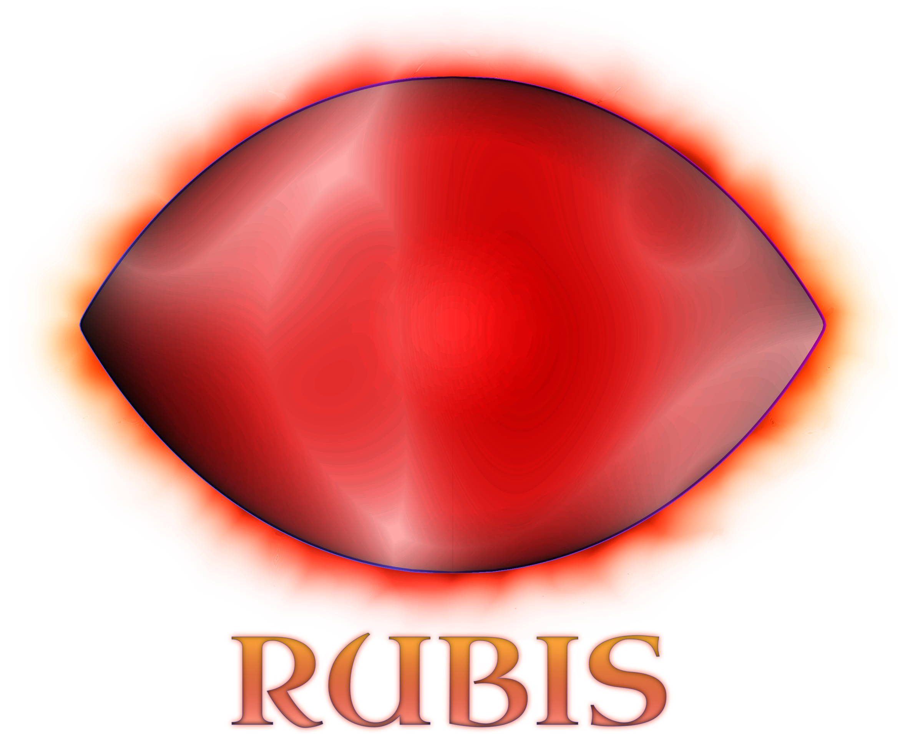

# RUBIS

RUBIS (*Rotation code Using Barotropy conservation over Isopotential
Surfaces*) computes the centrifugal deformation of barotropic stellar
and planetary models under conservative cylindrical rotation.

Starting from a spherically symmetric density profile, RUBIS constructs
a stationary axisymmetric model by preserving the barotropic relation
of the reference model on the deformed isopotential surfaces.
The gravitational potential is obtained by solving Poisson's equation
iteratively, while the centrifugal potential is prescribed by the
chosen rotation law.

## Physical model

RUBIS assumes hydrostatic equilibrium under the effective potential

$$
\Phi_{\rm eff} = \Phi_{\rm g} + \Phi_{\rm c},
$$

with

$$
\nabla P = -\rho \nabla\Phi_{\rm eff},
\qquad
\nabla^2\Phi_{\rm g} = 4\pi G\rho.
$$

The rotation is cylindrical and conservative,

$$
\Omega = \Omega(s),
\qquad
s = r\sin\theta,
$$

so that the centrifugal acceleration derives from the potential
$\Phi_{\rm c}$.

The initial spherical model provides the relation between density,
pressure and effective potential. RUBIS preserves this relation while
the isopotential surfaces are progressively deformed by rotation.

## Numerical method

The calculation proceeds iteratively:

1. the input spherical model is constructed and normalised;
2. the centrifugal potential is evaluated from the rotation law;
3. Poisson's equation is solved for the gravitational potential;
4. the mapping of the isopotential surfaces is updated;
5. the hydrostatic density and pressure profiles are reconstructed;
6. the model and rotation rate are rescaled to the requested
   normalisation;
7. the procedure is repeated until the mapping satisfies the chosen
   convergence criterion.

The angular dependence is represented through Legendre expansions.
The material geometry is described by a mapping

$$
r = r(\zeta,t),
\qquad
t = \cos\theta,
$$

where $\zeta$ labels the deformed isopotential surfaces.

### Radial solver

Continuous single-domain models are handled by the radial solver.
The density and thermodynamic profiles remain functions of the radial
isopotential coordinate, while the gravitational and centrifugal
fields are evaluated on the deformed two-dimensional mapping.

### Spheroidal solver

Models containing density discontinuities are handled by the
spheroidal solver. Each material region is represented as a separate
numerical domain, with duplicated coordinates on either side of an
interface. An exterior vacuum domain is added to impose the
gravitational boundary conditions.

With `method="auto"`, RUBIS selects the radial solver for a continuous
model and the spheroidal solver for a multidomain model.

## Installation

RUBIS requires Python 3.11 or later.

Clone the repository and install the package:

```bash
git clone https://src.koda.cnrs.fr/pierrehoudayer/RUBIS.git
cd RUBIS
python -m pip install -e .
```

Plotting utilities are optional:

```bash
python -m pip install -e ".[plot]"
```

For development:

```bash
python -m pip install -e ".[dev]"
```

The GitHub repository is maintained as a public mirror:

<https://github.com/pierrehoudayer/RUBIS>

## Quick start

The following example deforms an $n=3$ polytrope under solid rotation:

```python
from rubis import (
    DeformationConfig,
    PolytropeConfig,
    RotationConfig,
    SolverOptions,
    deform,
)
from rubis.rotation_profiles import solid


config = DeformationConfig(
    model=PolytropeConfig(
        index=3.0,
        n_points=501,
    ),
    rotation=RotationConfig(
        profile=solid,
        target=0.9,
    ),
    solver=SolverOptions(
        method="auto",
        max_degree=51,
        angular_resolution=51,
        mapping_precision=1.0e-10,
        verbose=True,
    ),
)

model, vacuum, info = deform(config)
```

`model` contains the converged material structure.
Its main fields include:

- the isopotential coordinate `zeta`;
- the angular grid `t = cos(theta)`;
- the physical mapping `r2d`;
- density and pressure;
- gravitational, centrifugal and effective potentials;
- the angular-velocity field.

`vacuum` contains the exterior solution produced by the spheroidal
solver. It is `None` for a model computed with the radial solver.

`info` records the numerical method, iteration count, final error,
elapsed time and polar-radius history.

Further examples are available in [`examples/`](examples/).

## Input models

RUBIS currently supports three kinds of spherical reference models.

### Single polytropes

```python
from rubis import PolytropeConfig

model = PolytropeConfig(
    index=3.0,
    radius=1.0,
    mass=1.0,
    n_points=501,
)
```

### Composite polytropes

Composite models contain several polytropic regions and may include
density discontinuities:

```python
import numpy as np

from rubis import CompositePolytropeConfig


model = CompositePolytropeConfig(
    indices=(1.0, 1.0),
    target_pressures=(-1.0, -np.inf),
    density_jumps=(0.4,),
    radius=1.0,
    mass=1.0,
    n_points=501,
)
```

Such models are automatically assigned to the spheroidal solver when
`method="auto"`.

### Tabulated models

Models stored in the historical RUBIS text format can be loaded with:

```python
from rubis import LegacyModelConfig

model = LegacyModelConfig(
    filename="model.txt",
    directory="/path/to/models",
)
```

RUBIS distributes a discontinuous Jupiter model as package data:

```python
model = LegacyModelConfig(filename="Jupiter.txt")
```

The corresponding source file is available at
[`src/rubis/data/Jupiter.txt`](src/rubis/data/Jupiter.txt).

## Rotation laws

The built-in cylindrical rotation laws are defined in
`rubis.rotation_profiles`:

- `solid`;
- `lorentzian`;
- `plateau`;
- `tabulated`.

Parameters specific to a rotation law are supplied through
`profile_parameters`:

```python
from rubis import RotationConfig
from rubis.rotation_profiles import lorentzian


rotation = RotationConfig(
    profile=lorentzian,
    target=0.6,
    profile_parameters={
        "alpha": 0.4,
    },
)
```

A tabulated law is first constructed from a file containing cylindrical
radius and angular velocity:

```python
from rubis.rotation_profiles import tabulated

rotation_profile = tabulated("rotation_profile.txt")

rotation = RotationConfig(
    profile=rotation_profile,
    target=0.6,
)
```

Custom rotation laws may also be supplied, provided that they return
the centrifugal potential and its radial derivative, or the angular
velocity when requested by RUBIS.

## Diagnostics and post-processing

A converged material model can be used to compute:

- the scalar virial balance;
- gravitational mass moments;
- the reconstructed surface radiative flux;
- two-dimensional plots of the model;
- output in the historical RUBIS format.

For example:

```python
from rubis.diagnostics import (
    compute_gravitational_moments,
    compute_virial_balance,
)


virial = compute_virial_balance(model)
moments = compute_gravitational_moments(model)
```

The radiative-flux reconstruction is currently available for
single-domain models:

```python
from rubis.flux import compute_radiative_flux

flux = compute_radiative_flux(model)
```

See [`examples/post_processing.py`](examples/post_processing.py) and
[`examples/plotting.py`](examples/plotting.py) for complete examples.

## Scope and limitations

RUBIS constructs stationary axisymmetric barotropic equilibria.
Its present formulation assumes a conservative cylindrical rotation
law and does not solve stellar evolution, thermal equilibrium or
meridional circulation.

The deformation is determined from a prescribed spherical reference
model. The physical accuracy of the result therefore also depends on
the suitability of this reference model and of the barotropic
approximation for the object under consideration.

## Tests

The test suite can be run with:

```bash
python -m pytest
```

The continuous-integration pipeline tests the package under Python 3.11
and 3.12, including installation from the built wheel.

## Reference

The numerical method is presented in:

P. S. Houdayer and D. R. Reese,
“RUBIS: A simple tool for calculating the centrifugal deformation of
stars and planets”,
*Astronomy & Astrophysics* **675**, A181 (2023).

<https://doi.org/10.1051/0004-6361/202346403>

## License

RUBIS is distributed under the GNU General Public License v3.0.
See [`LICENSE.md`](LICENSE.md).